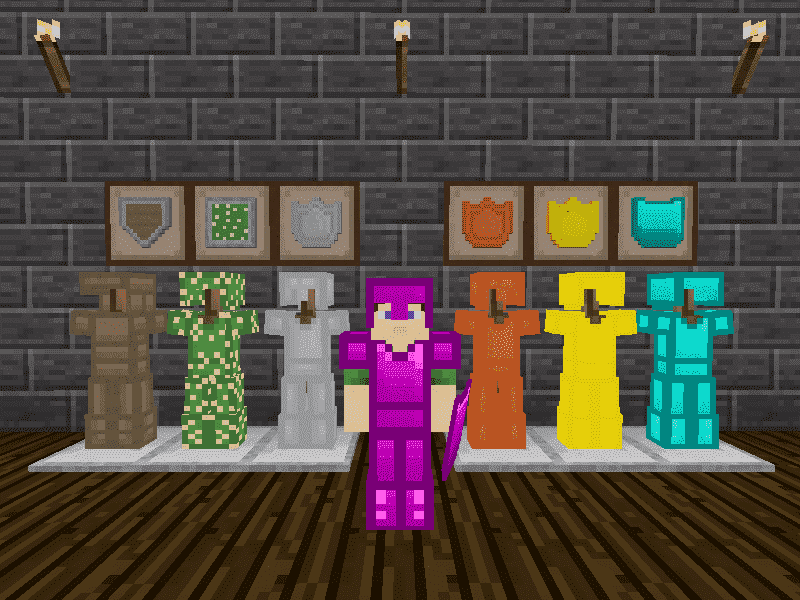

minetest mod 3d_armor
=====================

ARMOR for players

## Information
--------------

Adds craftable armor that is visible to other players that allows players to equip 
making them less vulnerable to weapons, takes damage when a player is hurt but 
also offers a percentage chance of healing.



## Technical info
-----------------

This mod is named `3d_armor` and each armor item worn contributes to a player's 
armor group level Armor Overall level is boosted by 10% when wearing a full matching set.

Fire protection added by TenPlus1 when using crystal armor if Ethereal mod active, level 1
protects against torches, level 2 for crystal spike, level 3 for fire, level 5 for lava.

#### Depends: 

* default

Following are need to manage armors on the player:

* sfinv
* unified_inventory
* smart_inventory

You must use only one.

Optional depends 

* player_monoids
* armor_monoid
* fire
* ethereal
* nether
* moreores

#### Configuration
-------------------

Override the following default settings by adding them to your minetest.conf file.

| Setting                |  type | default | descripton                    |
| ---------------------- | ---- | ---- | --------------------------------- |
| armor_material_wood    | bool | true | Set false to disable wood armors |
| armor_material_cactus  | bool | true | Set false to disable cactus armor |
| armor_material_steel   | bool | true | Set false to disable steel armor|
| armor_material_bronze  | bool | true | Set false to disable bronze armor |
| armor_material_diamond | bool | true | Set false to disable diamond armor |
| armor_material_gold    | bool | true | Set false to disable gold armor |
| armor_material_mithril | bool | true | Set false to disable mitrhil armor |
| armor_material_crystal | bool | true | Set false to disable crystal armors |
| armor_material_nether  | bool | true | Set false to disable nether armor   |
| armor_init_delay       | int  |  1   | Increase it if get glitches when a player first joins |
| armor_init_times       | int  |  1   | Number of initialization attempts if previous still happnes |
| armor_bones_delay      | int  |  1   | Increase it if armor is not getting into bones due to server lag.
| armor_update_time      | int  |  1   | How often player armor items are updated |
| armor_drop             | bool | true | If false will be into bones,otherwise Drop armor when a player dies |
| armor_destroy          | bool | false | Pulverise armor when a player dies, overrides armor_drop |
| armor_level_multiplier | int  | 1   | level to increaseeffects, 0.5 will reduce armor by half |
| armor_heal_multiplier  | int  | 1 | increase or decrease overall armor healing, 0 disable it |
| armor_water_protect    | bool | true | water protection (periodically restores breath when activated)
| armor_punch_damage     | bool | true | Enable punch damage effects. |
| armor_migrate_old_inventory | bool | true | Enable migration of old armor inventories |
| armor_fire_protect     | bool | false | fire protection (defaults true if using ethereal mod) |
| armor_fire_protect_torch | bool | false | allows you to disable fire damage from torches |

### API

##### Armor Registration:

`armor:register_armor(name, def)`

Wrapper function for `minetest.register_tool`, while registering armor as
a tool item is still supported, this may be deprecated in future so new code
should use this method.

Additional fields supported by 3d_armor:

```
	texture = <filename>
	preview = <filename>
	armor_groups = <table>
	damage_groups = <table>
	reciprocate_damage = <bool>
	on_equip = <function>
	on_unequip = <function>
	on_destroy = <function>
	on_damage = <function>
	on_punch = <function>

armor:register_armor_group(group, base)
```

Example:

```
armor:register_armor_group("radiation", 100)

armor:register_armor("mod_name:speed_boots", {
	description = "Speed Boots",
	inventory_image = "mod_name_speed_boots_inv.png",
	texture = "mod_name_speed_boots.png",
	preview = "mod_name_speed_boots_preview.png",
	groups = {armor_feet=1, armor_use=500, physics_speed=1.2, flammable=1},
	armor_groups = {fleshy=10, radiation=10},
	damage_groups = {cracky=3, snappy=3, choppy=3, crumbly=3, level=1},
	reciprocate_damage = true,
	on_destroy = function(player, index, stack)
		local pos = player:getpos()
		if pos then
			minetest.sound_play({
				name = "mod_name_break_sound",
				pos = pos,
				gain = 0.5,
			})
		end
	end,
})
```

See armor.lua, technic_armor and shields mods for more examples.

##### Default groups:

Elements: armor_head, armor_torso, armor_legs, armor_feet
Attributes: armor_heal, armor_fire, armor_water
Physics: physics_jump, physics_speed, physics_gravity
Durability: armor_use, flammable

Notes:

Elements may be modified by dependent mods, eg shields adds armor_shield.
Attributes and physics values are 'stackable', durability is determined
by the level of armor_use, total uses == approx (65535/armor_use), non-fleshy
damage groups need to be defined in the tool/weapon used against the player.

Reciprocal tool damage will be done only by the first armor inventory item
 with `reciprocate_damage = true`

##### Armor Functions:

`armor:set_player_armor(player)`

Primarily an internal function but can be called externally to apply any
changes that might not otherwise get handled.

`armor:punch(player, hitter, time_from_last_punch, tool_capabilities)`

Used to apply damage to all equipped armor based on the damage groups of
each individual item.`hitter`, `time_from_last_punch` and `tool_capabilities`
are optional but should be valid if included.

`armor:damage(player, index, stack, use)`

Adds wear to a single armor itemstack, triggers `on_damage` callbacks and
updates the necessary inventories. Also handles item destruction callbacks
and so should NOT be called from `on_unequip` to avoid an infinite loop.

`armor:remove_all(player)`

Removes all armors from the player's inventory without triggering any callback.

`armor:equip(player, armor_name)`

Equip the armor, removing the itemstack from the main inventory if there's one.

`armor:unequip(player, armor_name)`

Unequip the armor, adding the itemstack to the main inventory.

`armor:update_skin(player_name)`

Triggers a skin update with the same action as if a field with `skins_set` was submitted.

##### Item Callbacks:

on_equip = func(player, index, stack)
on_unequip = func(player, index, stack)
on_destroy = func(player, index, stack)
on_damage = func(player, index, stack)
on_punch = func(player, hitter, time_from_last_punch, tool_capabilities)

Notes:

`on_punch` is called every time a player is punched or takes damage, `hitter`,
`time_from_last_punch` and `tool_capabilities` can be `nil` and will be in the
case of fall damage, etc. When fire protection is enabled, hitter == "fire"
in the event of fire damage. Return `false` to override armor damage effects.
When armor is destroyed `stack` will contain a copy of the previous stack.

##### Global Callbacks:

armor:register_on_update(func(player))
armor:register_on_equip(func(player, index, stack))
armor:register_on_unequip(func(player, index, stack))
armor:register_on_destroy(func(player, index, stack))

Global Callback Example:

```
armor:register_on_update(function(player)
	print(player:get_player_name().." armor updated!")
end)
```

## LICENSE

License Source Code: (C) 2012-2017 Stuart Jones - LGPL v2.1

License Textures: Copyright (C) 2017 davidthecreator - CC-BY-SA 3.0

https://github.com/daviddoesminetest/3d-armors-new-textures

