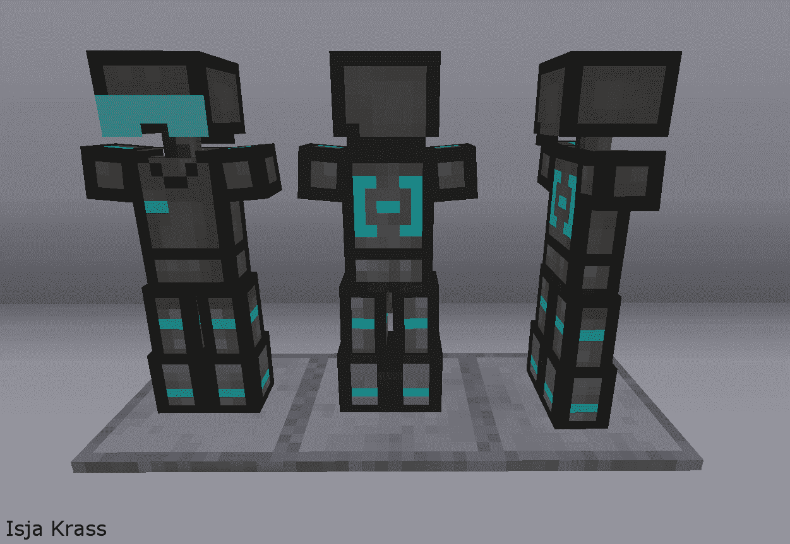

monetest mod  3d_armor_stand
============================

ARMOR STAND to put the armor out of the inventory view

## Information
--------------

This mod provides chest-like armor stand for armor storage and display.

## Technical info
-----------------

This mod must be named `3d_armor_stand` and enables a node where to put the armor pieces that is not a player.

It can be downloade from 
* https://git.minetest.io/minenux/minetest-mod-3d_armor
* https://codeberg.org/minenux/minetest-mod-3d_armor

#### Dependencies

* 3d_armor

#### Crafting

F = Wooden Fence [default:fence_wood]
S = Steel Ingot [default:steel_ingot]

+---+---+---+
|   | F |   |
+---+---+---+
|   | F |   |
+---+---+---+
| S | S | S |
+---+---+---+

## LICENSE

License Source Code: (C) 2012-2018 Stuart Jones - LGPL v2.1

